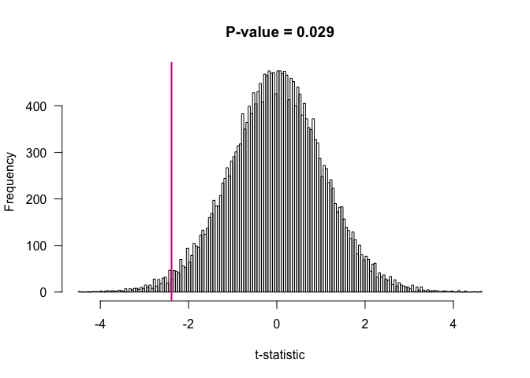

# Exhaustive Permutation Test
Karl Broman, Christina Koch  
`r Sys.Date()`  


This report performs an exhaustive permutation test
(with the t-statistic) on two vectors and plots the results


We will run the permutation test on these vectors: 


```
## [1] 6.20 5.72 6.07 6.75 5.50 6.39 4.30 4.96 5.48
```

```
## [1] 6.49 6.52 6.28 8.59 7.18 4.92 6.74 7.27
```


After running the permutation test, the t-statistic is -2.3859753 and the p-value is 0.0292884.  The graph corresponding to these values looks like this: 

 

```
## null device 
##           1
```

####Tools used in this report

```
## Session info --------------------------------------------------------------
```

```
##  setting  value                       
##  version  R version 3.1.2 (2014-10-31)
##  system   x86_64, darwin10.8.0        
##  ui       X11                         
##  language (EN)                        
##  collate  en_US.UTF-8                 
##  tz       America/Chicago
```

```
## Packages ------------------------------------------------------------------
```

```
##  package    * version date       source                            
##  devtools     1.7.0   2015-01-17 CRAN (R 3.1.2)                    
##  digest     * 0.6.8   2014-12-31 CRAN (R 3.1.2)                    
##  evaluate   * 0.5.5   2014-04-29 CRAN (R 3.1.0)                    
##  formatR    * 1.0     2014-08-25 CRAN (R 3.1.1)                    
##  htmltools  * 0.2.6   2014-09-08 CRAN (R 3.1.1)                    
##  knitr        1.9     2015-01-20 CRAN (R 3.1.2)                    
##  rmarkdown  * 0.3.10  2015-02-06 Github (rstudio/rmarkdown@b96214b)
##  rstudioapi * 0.2     2014-12-31 CRAN (R 3.1.2)                    
##  stringr    * 0.6.2   2012-12-06 CRAN (R 3.1.0)                    
##  yaml       * 2.1.13  2014-06-12 CRAN (R 3.1.0)
```
